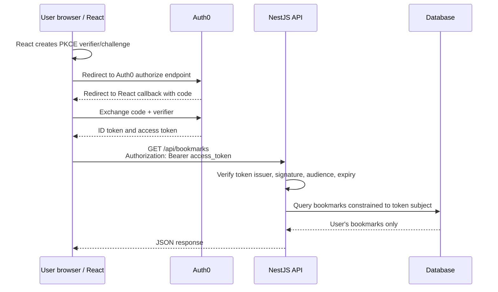
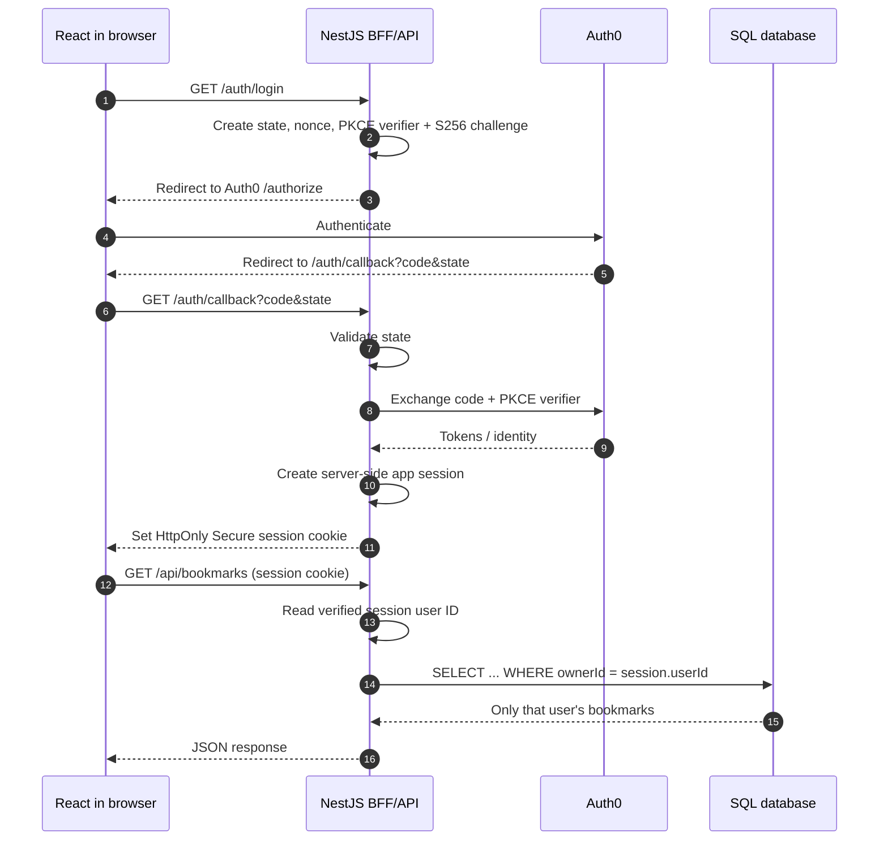
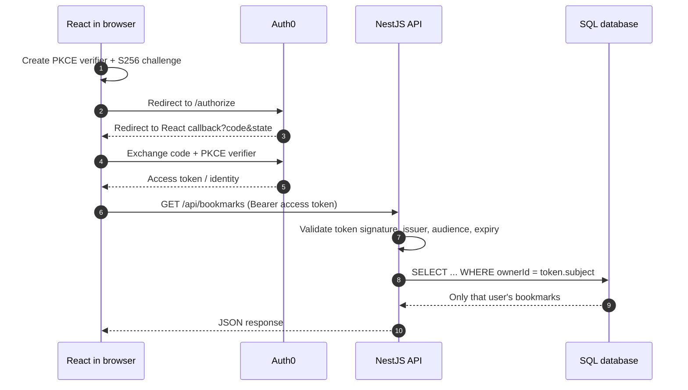

# Explain BFF auth flow plan

> I am reviewing the agent plan for my project. I am a little confused about the architecture decision regarding auth flow in backend and frontend. My initial plan is to use backend-for-frontend architecture for authentication/authorization flow. Explain the plan agent has generated for me.
>
> User context
>
> Attachments:
> - Project Agent Instruction Plan Summary Create three concise, inherited instruct…: `~/.codex/attachments/9edbd49a-1bfd-43dd-b999-4949ef5545e8/pasted-text.txt`

<details><summary>1 previous message</summary>

> I’ll read the plan and translate its auth-flow decision into the BFF model you intended, separating what it proposes from what that means in practice.
</details>

The generated plan does **not** describe a BFF authentication flow. It describes a conventional SPA + API setup:

```text
React frontend → Auth0 PKCE login → receives access token → NestJS API verifies OIDC token → Prisma data access enforces ownership
```

Its key auth rules are:

- The frontend uses Auth0 Authorization Code + PKCE S256.
- The backend derives the user only from the verified OIDC principal.
- The backend—not the UI—is authoritative for authorization.
- Every database access is owner-scoped, preventing cross-user reads or mutations.

That is secure when implemented correctly, but it means the browser-side React app participates directly in Auth0 authentication and normally sends bearer access tokens to the backend.

Your intended BFF architecture is instead:

```text
React frontend → same-origin NestJS BFF using secure session cookie → Auth0
                                      ↓
                                database / downstream APIs
```

In that model, the browser does not store or attach Auth0 access tokens to API calls. The NestJS backend handles login redirects and callback/code exchange, keeps tokens server-side if needed, establishes an `HttpOnly`, `Secure`, `SameSite` session cookie, and uses the session’s verified identity for every request. The frontend simply calls `/api/...` with cookie credentials.

So the plan’s “backend authorization is authoritative” part aligns with BFF, but these phrases conflict with it:

- “**Frontend: ... Auth0 PKCE**”
- “avoid exposing ... **token data unnecessarily**”

For BFF, make the intent unambiguous by changing the frontend instruction to something like:

> The frontend must not use an Auth0 SPA SDK, store access/refresh tokens, or send bearer tokens. It authenticates through the same-origin backend session and calls the BFF API with secure cookie credentials.

And the backend instruction:

> NestJS is the BFF. It owns Auth0/OIDC redirect and callback handling, validates session state, keeps OAuth tokens server-side, and protects session-changing requests against CSRF. Authorization derives exclusively from the server-side verified session principal.

PKCE is still compatible with BFF—it can be used during the backend’s authorization-code exchange—but it should be described as a **backend responsibility**, not a frontend one.

> What is "Authorization Code flow with PKCE (S256)"

<details><summary>2 previous messages</summary>

> I’ll give the plain-language version and verify the exact roles against the OAuth and PKCE specifications.
>
> <details><summary>Searched the web</summary>
>
> Searched the web for `RFC 7636 Proof Key for Code Exchange PKCE S256 code challenge ...`
>
> Searched the web for `RFC 7636 Proof Key for Code Exchange PKCE S256 code challenge ...`
>
> </details>
</details>

It’s a secure login pattern for OAuth/OIDC.

1. Your app creates a random secret called a `code_verifier`.
2. It calculates `code_challenge = BASE64URL(SHA-256(code_verifier))`—that SHA-256 form is **S256**.
3. It redirects the user to Auth0 with that challenge.
4. After login, Auth0 redirects back with a short-lived, one-time **authorization code**—not tokens.
5. Your app exchanges that code plus the original `code_verifier` for tokens.
6. Auth0 hashes the verifier and checks it matches the earlier challenge. If it does, it issues tokens.

```text
App ── challenge ──► Auth0 ── code ──► App
App ── code + original verifier ──► Auth0 ── tokens ──► App
```

PKCE prevents an attacker who steals the redirect’s authorization code from exchanging it: they do not possess the original verifier.

In your BFF design, the **NestJS BFF** performs these steps and retains any resulting tokens server-side; the React browser receives only a secure session cookie. PKCE is still useful—the owner of the verifier simply changes from the React app to the BFF. The `S256` option is the secure hashed form and is preferred over the legacy plain verifier option. [PKCE RFC 7636](https://www.rfc-editor.org/info/rfc7636/) [OAuth authorization-code grant RFC 6749](https://www.rfc-editor.org/info/rfc6749/)

> What exactly is a BFF design. and authorization code flow with PKCE implemented in the BFF will look like versus other architecture design. Including original plan a give you in the chat above. give me pros and cons for each. give me example in sequence diagram.

<details><summary>1 previous message</summary>

> I’ll compare the two concrete designs in your plan—the intended BFF session model and the generated SPA-token model—rather than introduce unrelated auth patterns.
</details>

A **Backend for Frontend (BFF)** is a server layer designed specifically for your web UI. The browser talks only to this backend; the backend handles identity, authorization, data, and any downstream APIs.

For this bookmark manager, the simple BFF is likely your existing NestJS backend—not an extra service:

```text
React browser → NestJS BFF/API → Prisma → SQL database
                  ↕
                Auth0
```

The important security property is that the browser has an app session cookie, while OAuth tokens (if any) remain on the server.

## 1. Your intended design: BFF + server session

The BFF uses Authorization Code with PKCE, but it performs the flow itself.

```mermaid
sequenceDiagram
    participant U as User browser / React
    participant B as NestJS BFF
    participant A as Auth0
    participant D as Database

    U->>B: GET /auth/login
    B->>B: Create state, nonce, PKCE verifier/challenge
    B-->>U: Redirect to Auth0 authorize endpoint (challenge + state)
    U->>A: Authenticate / consent
    A-->>U: Redirect /auth/callback?code=...&state=...
    U->>B: GET /auth/callback with code
    B->>B: Verify state
    B->>A: Exchange code + original PKCE verifier
    A-->>B: ID token, access/refresh token if requested
    B->>B: Validate identity; create application session
    B-->>U: Set HttpOnly Secure session cookie; redirect to app

    U->>B: GET /api/bookmarks (session cookie)
    B->>B: Read verified session user identity
    B->>D: Query bookmarks constrained to that user
    D-->>B: User's bookmarks only
    B-->>U: JSON response
```

If NestJS accesses the database itself, it may not need to use an Auth0 access token after login at all. Its session gives it the user identity it needs. Tokens are useful only if the BFF must call another protected API on the user’s behalf.

### Pros

- No OAuth access or refresh tokens exposed to React or JavaScript.
- The browser has one same-origin API and a normal secure session cookie.
- Easier to avoid CORS, token-refresh logic, and token leakage into browser storage or logs.
- The backend can shape API responses exactly for the UI.
- It matches your desire for backend-owned authentication and authorization.

### Cons

- NestJS must implement and operate sessions, login/callback routes, logout, and CSRF protection.
- Session storage/scaling must be considered if sessions are server-side.
- More backend responsibility; the frontend cannot independently call third-party APIs as the user.
- Cookie-authenticated state-changing requests need CSRF defenses (`SameSite` alone is not a universal substitute).

## 2. The generated plan: SPA token flow + protected API

This is not a BFF. React authenticates directly with Auth0, then sends an access token to NestJS. NestJS is an OAuth **resource server** and enforces data authorization.



This is what the original plan means by:

- “Frontend: … Auth0 Authorization Code with PKCE S256”
- “Backend authorization is authoritative”
- “Derive identity only from the verified OIDC principal”

The last two are correct and still essential. The conflict is that the **frontend** owns the OAuth exchange and token usage, rather than the BFF.

### Pros

- Less backend auth/session code.
- Stateless API requests can be simpler to scale.
- A separate frontend can call multiple APIs directly.
- This is a common and well-supported SPA approach.

### Cons

- The browser-side app handles bearer tokens and token renewal.
- More CORS, API audience, token-expiry, and client-side auth-state complexity.
- A stolen bearer token can be used until it expires.
- It does not fit your stated goal of keeping authentication/token handling in a BFF.

## What stays the same in both designs

PKCE prevents a stolen authorization code from being exchanged without the original verifier. `S256` means the verifier is protected by a SHA-256-based challenge rather than the legacy plain method. [RFC 7636](https://www.rfc-editor.org/info/rfc7636/)

PKCE is not authorization for your bookmarks. In both designs, NestJS must always:

- Derive the user from the verified session or token—not from a request body or URL.
- Query and mutate rows with an ownership condition.
- Return cross-user resources as inaccessible without revealing whether they exist.
- Test cross-user access denial.

## Recommendation for your project

Use the BFF design if it is your intended architectural boundary. Update the plan so it says:

> NestJS is the BFF and owns Auth0 authorization-code-with-PKCE login, callback, token exchange, server-side token handling, and secure session issuance. React must not use an Auth0 SPA SDK or hold OAuth tokens; it calls same-origin BFF endpoints using the session cookie.

> NestJS remains authoritative for authorization: every bookmark and collection database operation is constrained to the verified session principal.

That gives you the simpler React surface you want, while preserving the plan’s strongest rule: ownership is always enforced in the server-side data-access path.

> can you generate two mermaid diagram for each design again?

### BFF: NestJS owns OAuth and the session



### Original plan: React owns OAuth tokens; NestJS validates them



> I have deicide to go with the original SPA-direct plan. Because the original config are nudges toward SPA-direct plan (Callback URL, Logout URL being localhost:3000) even if the implementation of BFF are possible since a can running backend on port 3000. But i decide that even BFF look better for security reason (token never touch the browser), it isn't worth the time resource and the more test cases that will follow. Read [README.md](README.md) for convention and Archive my decision. in [DECISIONS.md](DECISIONS.md)

<details><summary>3 previous messages</summary>

> I’ll record this as the approved auth architecture decision, using the project’s existing decision-document convention and keeping the change limited to that file.
>
> The project’s decision log is empty, so I’m adding one compact ADR. It records that `localhost:3000` aligns with SPA-direct callbacks but does not technically force the choice; the deciding tradeoff is delivery scope and operational/test complexity.
>
> <details><summary>Edited a file</summary>
>
> - Wrote `./DECISIONS.md` (+27 -0)
>
> </details>
</details>

Archived your approved SPA-direct decision in [DECISIONS.md](./DECISIONS.md:1).

It records the PKCE flow, server-side ownership requirement, BFF tradeoff, and why BFF/session infrastructure is out of scope. `git diff --check` passes.
